# Verolux Management System - Architecture Diagrams

Dokumentasi diagram arsitektur sistem menggunakan Mermaid diagrams.

---

## 1. System Architecture Overview

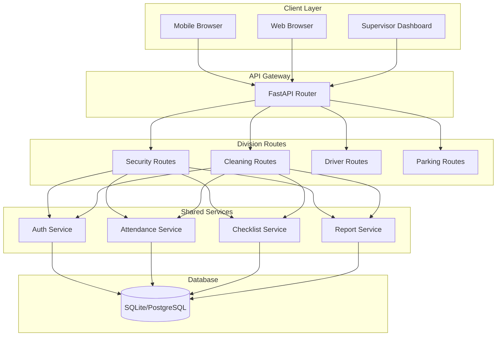

---

## 2. Authentication Flow

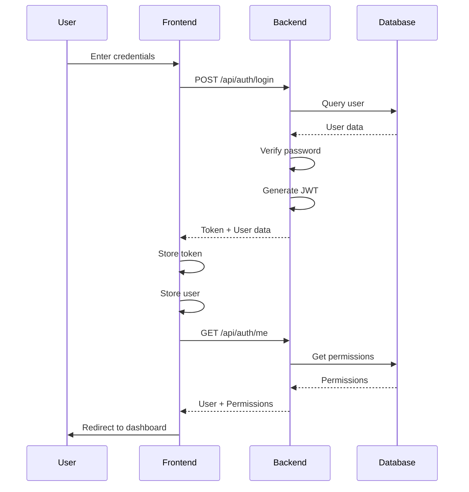

---

## 3. Attendance Check-In Flow

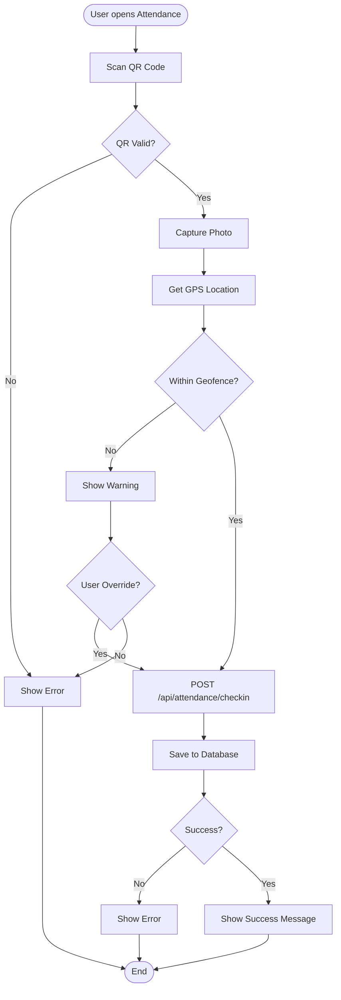

---

## 4. RBAC Permission Check Flow

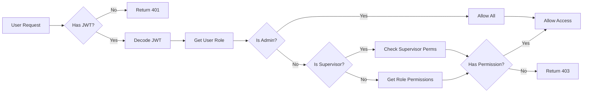

---

## 5. Master Data Management Structure

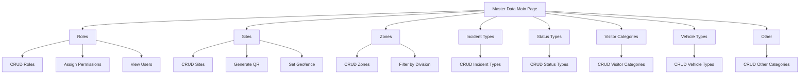

---

## 6. Database Entity Relationships

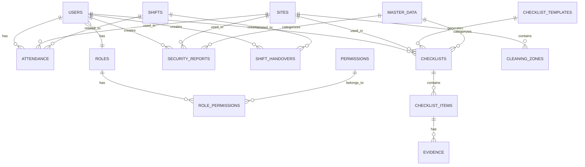

---

## 7. Division-Based Data Flow

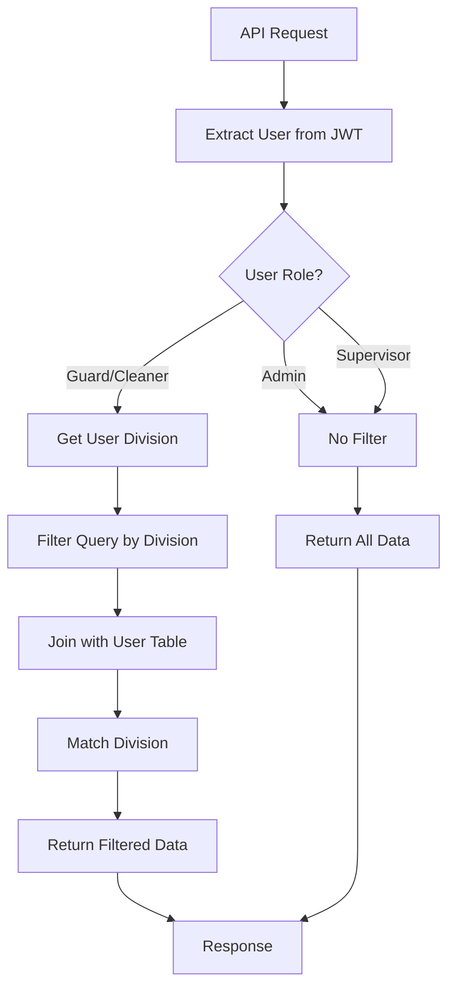

---

## 8. Passdown Notes Division Filtering

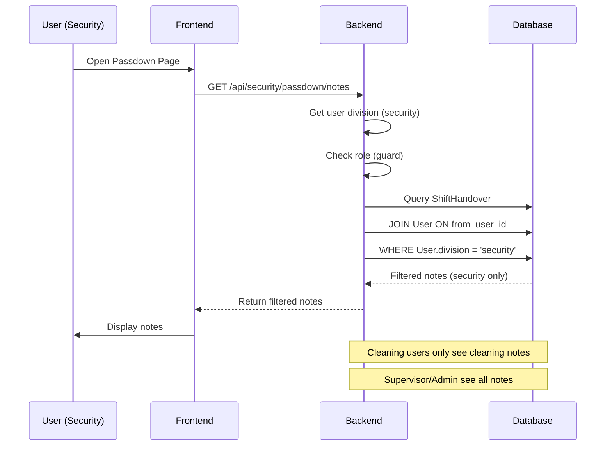

---

## 9. Master Data CRUD Flow

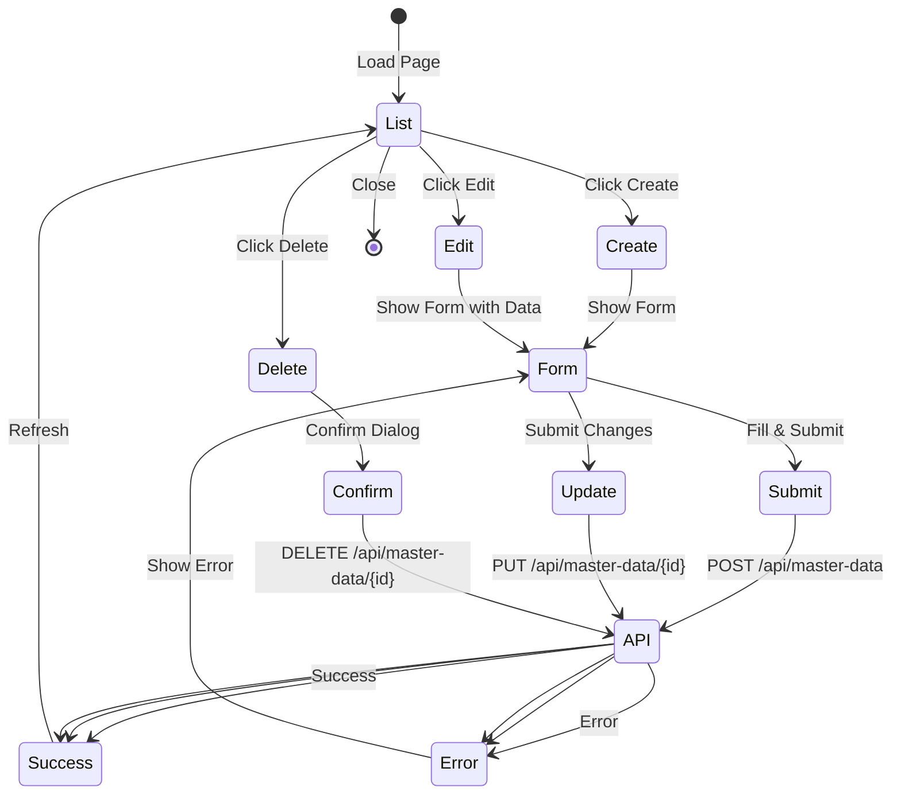

---

## 10. Frontend Component Hierarchy

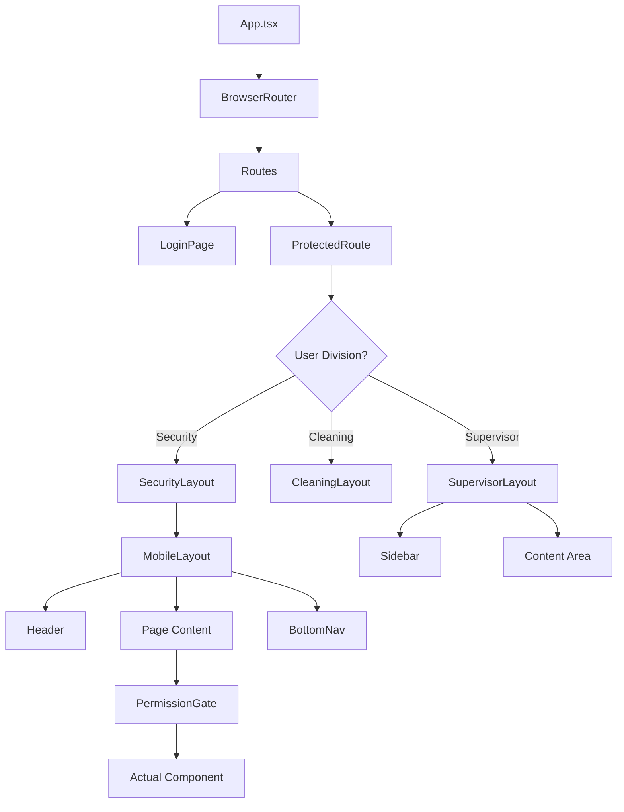

---

## 11. API Request Flow with Error Handling

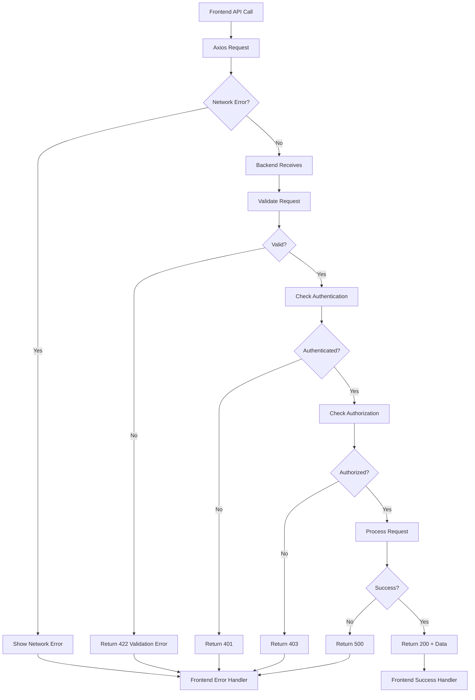

---

## 12. Master Data Connection: Roles → Users

```mermaid
graph LR
    A[Master Data: Roles] --> B[Select Role]
    B --> C[View Role Permissions]
    C --> D[View Users with Role]
    D --> E[Select User]
    E --> F[Update User Role]
    F --> G[PATCH /api/admin/users/id]
    G --> H[Backend Updates]
    H --> I[user.role_id = new_role.id]
    I --> J[User inherits Role Permissions]
    J --> K[Updated User]
    
    style A fill:#e1f5ff
    style B fill:#fff4e1
    style E fill:#fff4e1
    style K fill:#e1ffe1
```

---

## 13. Complete Request Lifecycle

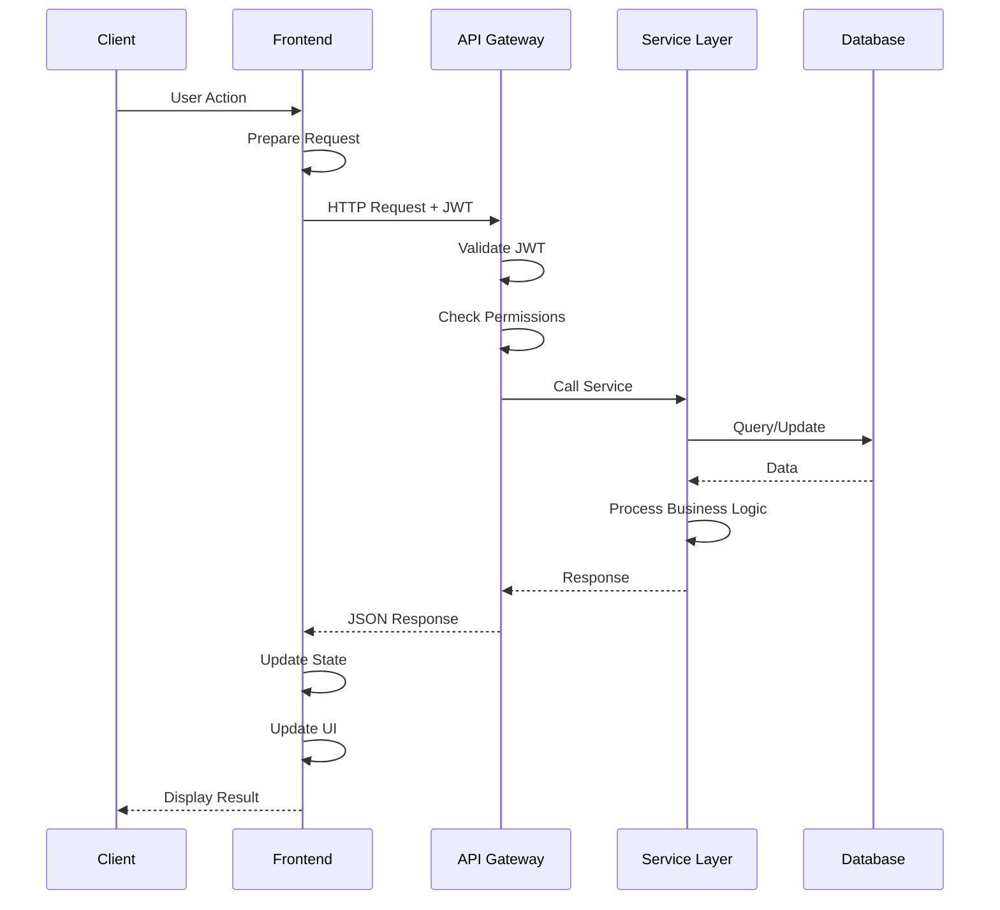

---

## 14. Division Routing Logic

```mermaid
flowchart TD
    A[User Login] --> B[Get Division from User]
    B --> C{Division?}
    C -->|security| D[/security/*]
    C -->|cleaning| E[/cleaning/*]
    C -->|driver| F[/driver/*]
    C -->|parking| G[/parking/*]
    C -->|supervisor| H[/supervisor/*]
    C -->|admin| I[/supervisor/admin/*]
    
    D --> J[Security Dashboard]
    E --> K[Cleaning Dashboard]
    F --> L[Driver Dashboard]
    G --> M[Parking Dashboard]
    H --> N[Supervisor Dashboard]
    I --> O[Admin Panel]
```

---

## 15. Permission Gate Flow

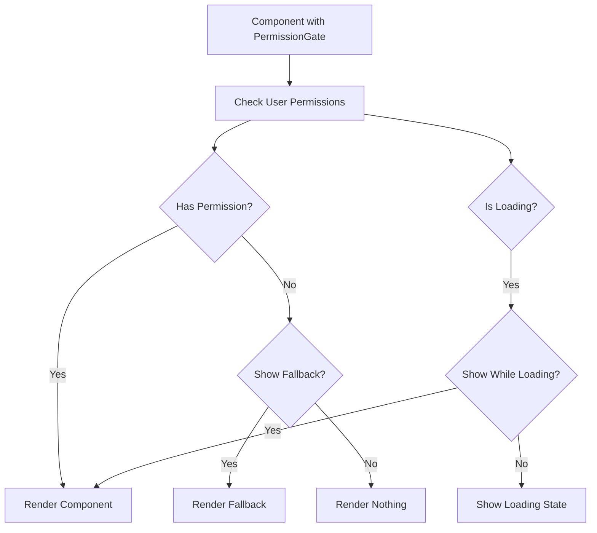

---

## 16. Data Filtering Strategy

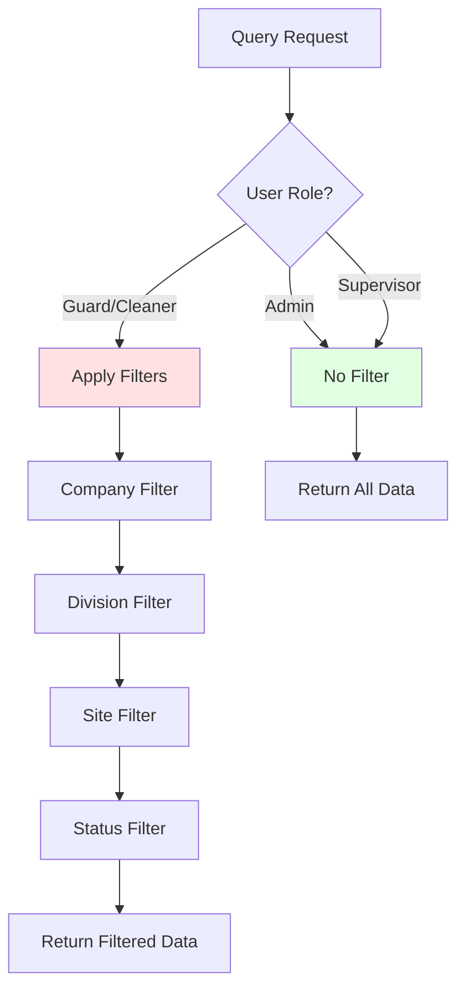

---

## 17. Master Data Category Structure

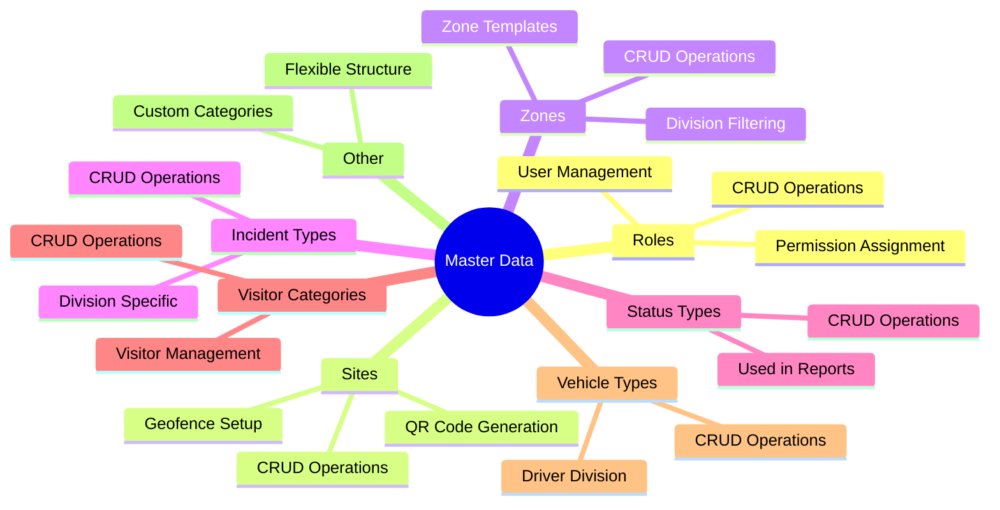

---

## 18. System Module Dependencies

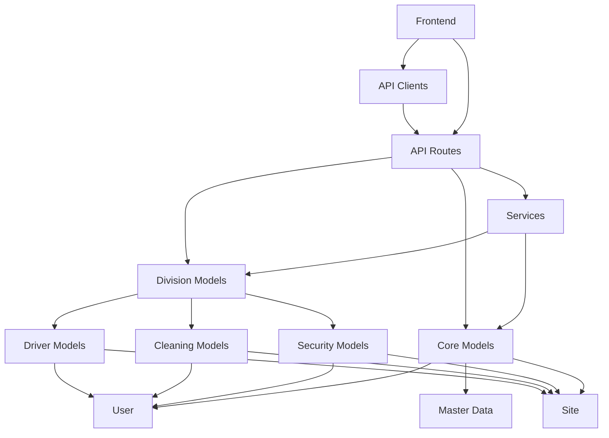

---

## 19. Passdown Notes Division Isolation

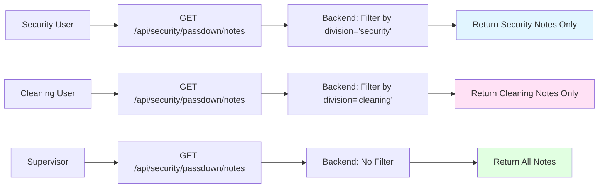

---

## 20. Complete Feature Implementation Flow

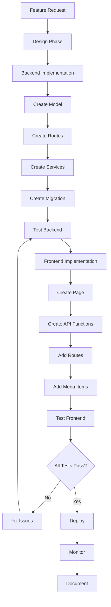

---

## Diagram Usage

Semua diagram di atas menggunakan format **Mermaid** yang dapat dirender di:
- GitHub (otomatis)
- GitLab (otomatis)
- VS Code dengan extension Mermaid
- Online: https://mermaid.live
- Documentation tools (MkDocs, Docusaurus, dll)

---

**Document Version:** 1.0  
**Last Updated:** 2025-01-15

